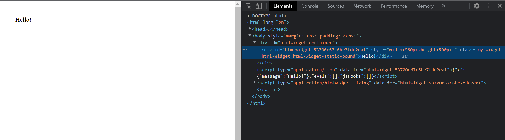
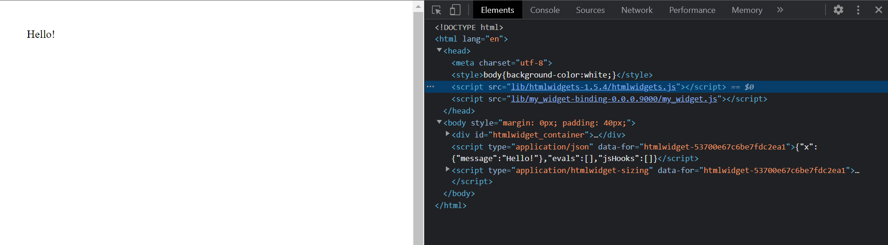
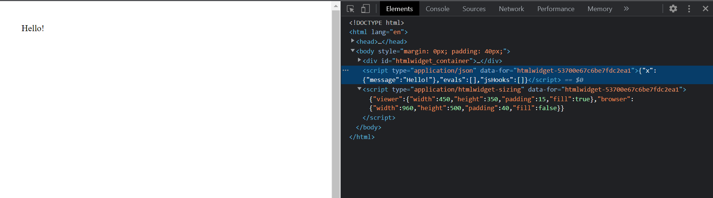

# Your First Widget

**Learning objectives:**

- How to build a minimal widget
- How each widget component works

## Scaffold in 2 lines of code

Two lines of code:

```{r, eval=FALSE}
# 1 - Create a package (template)
usethis::create_package(path = "path/to/my.package")

# 2 - Create a widget (scaffold)
htmlwidgets::scaffoldWidget(name = "my_widget")
```

Line 1, obviously, creates a package

Line 2, as the function name suggests, creates the scaffolding for a widget--that is the minimum files for defining a JS widget:

- `my_widget.R`. Functions in R that capture user parameters and pass them to JS.
- `my_widget.js`. Functions in JS, using content/parameters passed from R functions.
- `my_widget.yaml` JS dependencies, meaning the JS library the widget wraps as well as any libraries upon which that library depends.

## R functions

### Overview

The R script created by `htmlwidgets::scaffoldWidget()`, `my_widget.R` contains three functions:

- `my_widget`. Binds together R and JS by:
  - collecting R parameters (for JS) in a list `x`
  - creating a widget that accesses `x`
- `my_widgetOutput`. Defines an `*Output()` function for Shiny.
- `renderMy_widget`. Defines a `render*()`` function for Shiny.

```{r, eval=FALSE}
#' <Add Title>
#'
#' <Add Description>
#'
#' @import htmlwidgets
#'
#' @export
my_widget <- function(message, width = NULL, height = NULL, elementId = NULL) {

  # forward options using x
  x = list(
    message = message
  )

  # create widget
  htmlwidgets::createWidget(
    name = 'my_widget',
    x,
    width = width,
    height = height,
    package = 'my.package',
    elementId = elementId
  )
}

#' Shiny bindings for my_widget
#'
#' Output and render functions for using my_widget within Shiny
#' applications and interactive Rmd documents.
#'
#' @param outputId output variable to read from
#' @param width,height Must be a valid CSS unit (like \code{'100\%'},
#'   \code{'400px'}, \code{'auto'}) or a number, which will be coerced to a
#'   string and have \code{'px'} appended.
#' @param expr An expression that generates a my_widget
#' @param env The environment in which to evaluate \code{expr}.
#' @param quoted Is \code{expr} a quoted expression (with \code{quote()})? This
#'   is useful if you want to save an expression in a variable.
#'
#' @name my_widget-shiny
#'
#' @export
my_widgetOutput <- function(outputId, width = '100%', height = '400px'){
  htmlwidgets::shinyWidgetOutput(outputId, 'my_widget', width, height, package = 'my.package')
}

#' @rdname my_widget-shiny
#' @export
renderMy_widget <- function(expr, env = parent.frame(), quoted = FALSE) {
  if (!quoted) { expr <- substitute(expr) } # force quoted
  htmlwidgets::shinyRenderWidget(expr, my_widgetOutput, env, quoted = TRUE)
}


```


### Output

Create some output in this way:

```{r, eval=FALSE}
# create documentation (optionally)
devtools::document()
# while package project, load the package
devtools::load_all()
# create some output by passing a character from
my_widget(message = "Hello!")
```

#### `<div>`



#### `<head>`



#### `<script>`



## JS function

### Overview

```{js, eval=FALSE}
HTMLWidgets.widget({

  name: 'my_widget',

  type: 'output',

  factory: function(el, width, height) {

    // TODO: define shared variables for this instance

    return {

      renderValue: function(x) {

        // TODO: code to render the widget, e.g.
        el.innerText = x.message;

      },

      resize: function(width, height) {

        // TODO: code to re-render the widget with a new size

      }

    };
  }
});

```

### Output

#### How

What you put in the element is what you see.

The section will follow this recipe:

- Change JS function, specifying what to put in element
- Reload package via `devtools::load_all()`
- Execute with `my_widget()` with appropriate parameter(s)

#### What

- Object itself: `console.log(x)`
- Text: `innerText`
- HTML of element: `innerHTML`
- Style of element `style.*`

## JS dependencies

```{r, eval=FALSE}
# (uncomment to add a dependency)
# dependencies:
#  - name:
#    version:
#    src:
#    script:
#    stylesheet:

```

## Resources

- For other treatments of creating a widget with `{htmlwidgets}`, see
  - package vignette [here](https://www.htmlwidgets.org/develop_intro.html).
  - overview and worked example in js4shiny workshop materials [here](https://js4shiny.com/slides/htmlwidgets.html#1)
- For a deeper dive into JS for R users, see
  - [JavaScript for Shiny users rstudio::conf(2020) workshop materials](https://js4shiny.com/)
  - [js4shiny package](https://pkg.js4shiny.com/), which offers a REPL

## Meeting Videos

### Cohort 1

`r knitr::include_url("https://www.youtube.com/embed/URL")`

<details>
<summary> Meeting chat log </summary>

```
00:11:46	russ:	Hi everyone
00:15:33	russ:	We're having a live demo
00:53:14	russ:	Ah. There's a neat step-through example in the shiny tutorials here: https://shiny.rstudio.com/articles/js-build-widget.html
00:53:52	russ:	In the shiny server side, you do `renderMyWidget(MyWidget(data))`
01:02:56	russ:	Ah! The "data-for" attribute seems to be a htmlwidgets-specific thing. If you look in the source code for htmlwidgets.js , how it is handled is described in there
01:08:19	russ:	There's also a nice chapter about htmlwidgets in the Rmarkdown guide: https://bookdown.org/yihui/rmarkdown/html-widgets.html
01:13:24	LUCIO ENRIQUE CORNEJO RAM REZ:	thanks everyone, bye
01:13:29	russ:	THanks everyone
```
</details>
