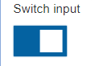
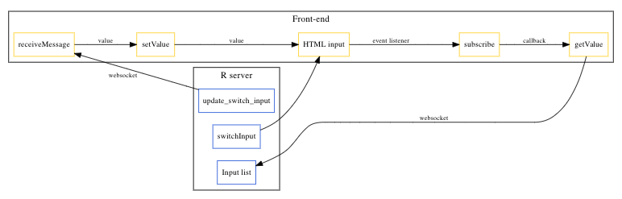

# Custom Inputs

**Learning objectives:**

- Understand how to build input UI
- See how to bind inputs to Shiny

## Roadmap

Build

- Input UI element
- Bindings that permit app to react to changes in input UI element

## Checkbox in Shiny

Function:

```{r checkbox_code, eval=FALSE}
shiny::checkboxInput(inputId = "my_id", label = "My checkbox")
```

HTML output:

```{html, eval=FALSE}
<div class="form-group shiny-input-container">
  <div class="checkbox">
    <label>
      <input id="my_id" type="checkbox"/>
      <span>My checkbox</span>
    </label>
  </div>
</div>
```

## Desired checkbox

Looks:



[Template from w3 schools](https://www.w3schools.com/howto/howto_css_switch.asp)

HTML:

```{html, eval=FALSE}
<label class="switch">
  <input type="checkbox">
  <span class="slider"></span>
</label>
```

CSS:

```{css, eval=FALSE}
.switch {
  position: relative;
  display: inline-block;
  width: 60px;
  height: 34px;
}

.switch input { 
  opacity: 0;
  width: 0;
  height: 0;
}

.slider {
  position: absolute;
  cursor: pointer;
  top: 0;
  left: 0;
  right: 0;
  bottom: 0;
  background-color: #ccc;
  -webkit-transition: .4s;
  transition: .4s;
}

.slider:before {
  position: absolute;
  content: "";
  height: 26px;
  width: 26px;
  left: 4px;
  bottom: 4px;
  background-color: white;
  -webkit-transition: .4s;
  transition: .4s;
}

input:checked + .slider {
  background-color: #0462a1;
}

input:focus + .slider {
  box-shadow: 0 0 1px #0462a1;
}

input:checked + .slider:before {
  -webkit-transform: translateX(26px);
  -ms-transform: translateX(26px);
  transform: translateX(26px);
}
```

## Building the switch

### Desired input tag

```
<label class="switch">
  <input type="checkbox">
  <span class="slider"></span>
</label>
```

### Input tag

```{r, eval=FALSE}
# app.R
switchInput <- function(id) {

  # create input tag with appropriate type and class
  tags$input(
    id = id, 
    type = "checkbox", 
    class = "switchInput"
  )

}
```


### Switch UI

```{r}
switchInput <- function(id, label, checked = TRUE) {
  
  # create input tag with appropriate type and class
  input <- tags$input(
    id = id, 
    type = "checkbox", 
    class = "switchInput"
  )
  
  if(checked)
    input <- htmltools::tagAppendAttributes(input, checked = NA)
  
  # Compose switch input widget:
  # - Text label
  # - Label tag that contains
  #   - Input
  #   - Slider
  # - Add classes where appropriate
  form <- tagList(
    p(label),
    tags$label(
      class = "switch",
      input,
      tags$span(class = "slider")
    )
  )
  
  return(form)
}
```

### Dependencies

```{r, eval=FALSE}
#' Switch UI
#' 
#' Operates as a checkbox but styled as a switch
#' 
#' @param id Character. Id of UI component.
#' @param label Character. Label for UI component.
#' @param checked Logical. Initial state of switch input.
switchInput <- function(id, label, checked = TRUE) {
  
  # create input tag with appropriate type and class
  input <- tags$input(
    id = id, 
    type = "checkbox", 
    class = "switchInput"
  )
  
  if(checked)
    input <- htmltools::tagAppendAttributes(input, checked = NA)
  
  # Compose switch input widget:
  # - Text label
  # - Label tag that contains
  #   - Input
  #   - Slider
  # - Add classes where appropriate
  form <- tagList(
    p(label),
    tags$label(
      class = "switch",
      input,
      tags$span(class = "slider")
    )
  )
  
  path <- normalizePath("./assets")
  
  # create dependencies: CSS and JS
  deps <- htmltools::htmlDependency(
    name = "switchInput",
    version = "1.0.0",
    src = c(file = path),
    script = "binding.js",
    stylesheet = "styles.css"
  )
  
  # attaches dependencies to custom input
  htmltools::attachDependencies(form, deps)
  
}
```


## Desired functionality/JS bindings

- Find input in DOM
- Get value in DOM
- Set value in DOM
- Receive instructions from the Shiny server on how input value should change
- Listen for changes in DOM and notify Shiny when changes occur
- Dictate how quickly app should react to input changes

These correspond to extension methods for the Shiny input bindings:

- `find`
- `getId`
- `getValue`
- `setValue`
- `receiveMessage`
- `subscribe`
- `getRatePolicy`

They communication model can be sketched as follows:



## Building the JS bindings

```{js, eval=FALSE}
// set bindings
var switchInput = new Shiny.InputBinding();

// extend bindings
$.extend(switchInput, {
  // find elements in DOM with switchInput class (i.e., class of switch UI input)
  find: function(scope) {
    return $(scope).find(".switchInput");
  },
  // get the checked attribute of that element
  // normally, would want to use val() to get the value
  // but the input is a checkbox and has a checked attribute
  getValue: function(el) {
    return $(el).prop("checked");
  },
  // change the checked attribute to the desired value: true/false
  // see more here for prop: https://www.w3schools.com/jquery/html_prop.asp
  // see more here for change event: https://www.w3schools.com/jquery/jquery_events.asp
  setValue: function(el, value) {
    $(el).prop("checked", value).change();
  },
  // handle messages sent from the server
  // change the input accordingly by invoking setValue method
  receiveMessage: function(el, value){
    this.setValue(el, value);
  },
  // set an event listener on switchInput
  // notify Shiny to update the value on the server when checked values changes in DOM
  // see more on on() method here: https://www.w3schools.com/jquery/jquery_events.asp
  subscribe: function (el, callback) {
    $(el).on("change.switchInput", function(){
      callback(true);
    })
  },
  // stop Shiny from updating the server
  unsubscribe: function(el) {
    $(el).off(".switchInput");
  },
  getRatePolicy: function(){
    return {
      policy: 'throttle',
      delay: 1000
    }
  }
});

Shiny.inputBindings.register(switchInput, 'john.switch');
```


## Meeting Videos

### Cohort 1

`r knitr::include_url("https://www.youtube.com/embed/URL")`

<details>
<summary> Meeting chat log </summary>

```
LOG
```
</details>
